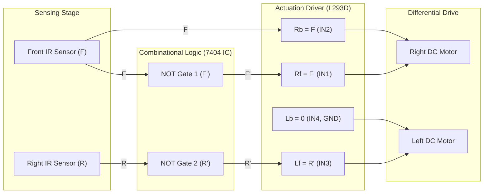

# 🤖 Autonomous Maze Solver Robot using Digital Systems

[](https://opensource.org/licenses/MIT)
[](#hardware-specifications)
[](https://www.annauniv.edu/)
[](simulation/simulate_robot.py)

> **A Microcontroller-Free Autonomous Maze Solving Robot Powered Entirely by Combinational Digital Logic (NOT Gates & L293D Motor Driver).**

---

## 📌 Overview

Traditional autonomous maze-solving robots rely on microcontrollers (such as Arduino, ESP32, or STM32) running procedural code. This project demonstrates how **pure combinational digital logic** can accomplish autonomous maze navigation using just **two digital IR obstacle sensors**, a **7404 Hex Inverter IC (NOT gates)**, and an **L293D dual H-Bridge motor driver**.

By leveraging Boolean algebra and digital switching circuits, the robot evaluates real-time obstacle presence in microseconds without firmware overhead, CPU cycles, or software bugs.

---

## 📸 Hardware Prototype & Circuit

<div align="center">
  
  <p><em>Figure 1: Assembled Hardware Prototype with Dual IR Sensors and Breadboard Logic Circuit.</em></p>
</div>

<div align="center">
  
  <p><em>Figure 2: Complete Circuit Schematic (7404 Inverter IC + L293D Driver + IR Sensors).</em></p>
</div>

---

## 🧠 System Architecture & Block Diagram



---

## 🧮 Boolean Logic & Truth Table

### 1. Sensor Digital Definitions
- **$F$ (Front Sensor)**: `0` = Path clear ahead, `1` = Obstacle detected ahead.
- **$R$ (Right Sensor)**: `0` = Right side clear, `1` = Right wall / obstacle detected.

### 2. Output Logic Equations
- **Right Motor Forward ($R_f$)** = $\overline{F} = F'$
- **Right Motor Backward ($R_b$)** = $F$
- **Left Motor Forward ($L_f$)** = $\overline{R} = R'$
- **Left Motor Backward ($L_b$)** = $0$ *(Permanently grounded)*

### 3. Truth Table & Decision Matrix

| Front ($F$) | Right ($R$) | $F'$ | $R'$ | $R_f$ (Right Fwd) | $R_b$ (Right Rev) | $L_f$ (Left Fwd) | $L_b$ (Left Rev) | Robot Movement / Action |
|:---:|:---:|:---:|:---:|:---:|:---:|:---:|:---:|:---|
| **0** | **0** | `1` | `1` | **1** | **0** | **1** | **0** | 🟢 **Move Forward** (Corridor clear) |
| **0** | **1** | `1` | `0` | **1** | **0** | **0** | **0** | 🟡 **Slight Left Turn** (Steer away from right wall) |
| **1** | **0** | `0` | `1` | **0** | **1** | **1** | **0** | 🔵 **Turn Right** (Wall ahead, pivot into free right opening) |
| **1** | **1** | `0` | `0` | **0** | **1** | **0** | **0** | 🔴 **Move Backward & Pivot Left** (Dead corner escape) |

---

## 🛠️ Hardware Bill of Materials (BOM)

| S.No | Component | Quantity | Description / Specification |
|:---:|:---|:---:|:---|
| 1 | **IR Obstacle Sensor (Front)** | 1 | Active-low / active-digital optical proximity sensor |
| 2 | **IR Obstacle Sensor (Right)** | 1 | Digital infrared obstacle sensor with comparator |
| 3 | **7404 Hex Inverter IC** | 1 | 74LS04 / 74HC04 TTL/CMOS NOT gate IC (14-pin DIP) |
| 4 | **L293D Motor Driver IC** | 1 | Dual H-Bridge motor driver (16-pin DIP, 600mA/ch) |
| 5 | **BO DC Geared Motors** | 2 | 3-6V Dual shaft BO gear motors + rubber wheels |
| 6 | **2WD Robot Chassis** | 1 | Acrylic chassis kit with castor wheel & standoffs |
| 7 | **Power Supply** | 1 | 9V DC Battery / 7.4V Li-ion pack with 5V regulator |
| 8 | **Solderless Breadboard** | 1 | Half-size 400-point breadboard |
| 9 | **Jumper Wires** | As needed | Male-to-Male & Male-to-Female jumper wires |

For full pin connections and wiring schematics, see [docs/PIN_MAPPING.md](docs/PIN_MAPPING.md).

---

## 💻 Virtual Simulation & Testbench

A standalone Python testbench is included to verify the combinational truth table and step through virtual maze navigation scenarios.

### Running the Simulator:
```bash
# Run the automated truth table check and maze simulation
python simulation/simulate_robot.py

# Run interactive sensor input mode
python simulation/simulate_robot.py --interactive
```

---

## 📂 Repository Structure

```text
maze-solver-robot-digital-logic/
│
├── docs/                                  # Documentation and academic reports
│   ├── Maze_Solver_Robot_Report.pdf       # Full Project Mini-Project Report
│   └── PIN_MAPPING.md                     # Complete IC Pinout & Wiring Manual
│
├── hardware/                              # Circuit schematics
│   └── circuit_diagram.png                # High-resolution Circuit Diagram
│
├── media/                                 # Prototype photographs & media
│   ├── hardware_setup.png                 # Real hardware setup photo
│   └── circuit_diagram.png                # Reference schematic diagram
│
├── simulation/                            # Simulation & verification
│   └── simulate_robot.py                  # Python logic simulator & testbench
│
├── .gitignore                             # Git ignore configuration
├── CONTRIBUTING.md                         # Contribution guidelines
├── LICENSE                                # MIT License
└── README.md                              # Main documentation (this file)
```

---

## ⚡ Key Highlights & Advantages

- ⚡ **Zero Latency**: Nanosecond-level gate propagation delays ($t_{pd} \approx 10\text{ns}$) for instantaneous reaction.
- 📉 **No Firmware / No Bugs**: Eliminates code compilation, memory leaks, and microcontroller crashing.
- 💡 **Educational Value**: A practical real-world demonstration of Boolean algebra and combinational digital logic design.
- 🔋 **Low Cost**: Built entirely using affordable, off-the-shelf discrete ICs.

---

## 👥 Authors & Academic Credits

This project was developed as part of the **Digital System Design Laboratory** course (**EI23402 / EI5402**):

* **Kishore Kumar A** (Reg No: `2023505018`)
* **Dravid Anand D** (Reg No: `2023505021`)

**Project Supervisor:**  
**Dr. C. Shanthi**, Professor,  
Department of Instrumentation Engineering,  
**Madras Institute of Technology (MIT) Campus, Anna University**, Chennai – 600 044.

📄 **Full Report:** [Download Project Report PDF](docs/Maze_Solver_Robot_Report.pdf)

---

## 📜 License

This project is licensed under the [MIT License](LICENSE) - feel free to use, modify, and build upon it for academic and non-commercial purposes.
